

  
# Open Wink Hardware Module
  
Hardware Module for the openwink project, an open sourced alternative to the MX-5 [Wink/Sleepy Eye Mod](https://mx5tech.co.uk/wink-sleepy-eye-mod)
  
### Technologies

 

# Table of Contents
- [About the Project](#about-the-project)
- [Version History](#version-history)
- [Project Features](#project-features)
- [Purchasing](#purchasing)
  - [Support the Project](#support-the-project)
- [Acknowledgements](#acknowledgements)
- [Contact](#contact-me)

## About the Project

This project began as a continuation of seasaltsaige's [pop up wink mod](https://github.com/seasaltsaige/popup-wink-mod), with the goal of creating custom hardware to streamline and minaturize the existing project built from off the shelf components

This project serves as an open source (though purchasable) alternative to the popular [MX-5 Tech Wink Mod](https://mx5tech.co.uk/wink-sleepy-eye-mod). This repository contains the design information for the hardware module component of this project.
- Hardware development Version History
  - Discusses changes throughout all three revisions
  - Documents why we made certain design choices
- Board Features
- Current Hardware Version Design

## Version History

### Revision 1

Although the initial project this module was based around utilized an Arduino Nano 33 BLE and other off the shelf boards, we ended up choosing an Espressif ESP32-S3 due to easier access to coded PHY functionality required for useable ranges.

  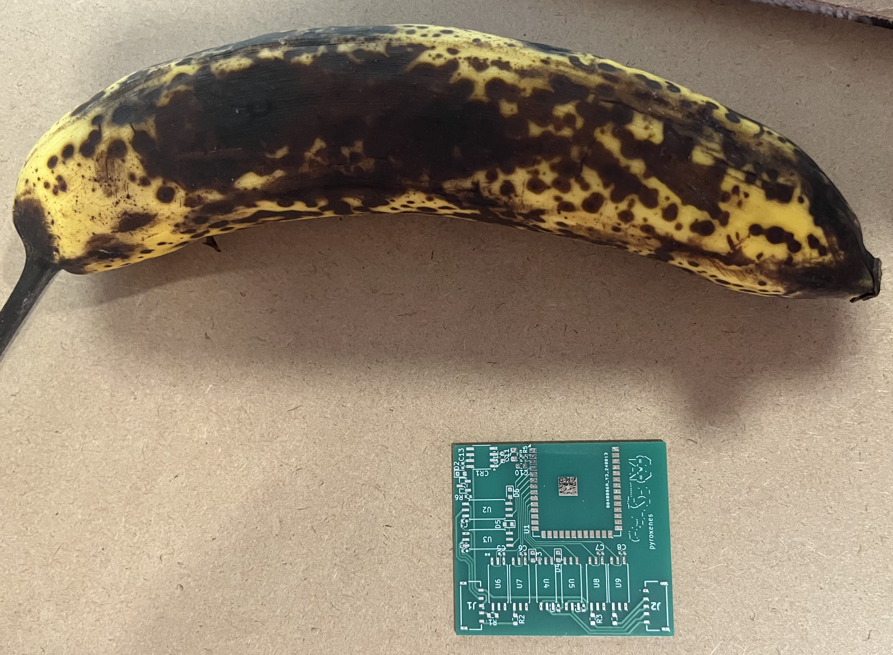</img>
  
Unpopulated first revision board

  <b>⏦</b>
 

 
Two signal wires providing a potential of atleast 12v are required to drive a NA Miata headlight motor at a resonable speed. One wire must be sent high and the other kept low to open the healight, and this must be inverted to lower the headlight. If both wires are sent high, the headlight will continue to open and close until one wire goes low. In order to provide these 12v+ signals from a 3.3v logic level micro controller, we decided to utilize optocouplers to switch the headlight supply power. For this revision we utilized TLP5701 optocouplers. On this revision we also used these same optocouplers, with a series resistor, to measure the two status wires for each of the headlights. This approach proved to be overkill on further investigation into the motor. We also were not able to get the measurement of the status wires working with the optocouplers on this version.

  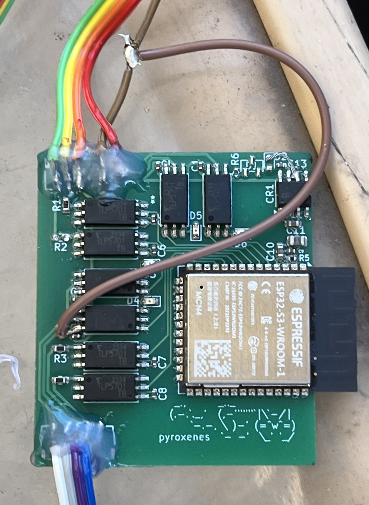</img>
  
Assembled first revision board during testing

  <b>⏦</b>
 

 
The voltage range provided to the headlights by the Miata ranges between 12-15v, but the ESP32 requires a much smaller supply voltage of 3.3v. We ended up selecting a KF33BD-TR LDO to generate the 3.3v required to run the ESP32. Due to heat generated from this large voltage step down, we utilized a two stage power supply in the second revision. 
The connectors we chose were two five position AUH series wire-to-board connectors from JST. These connectors ended up being too small for our crimping tools so this revision was tested by soldering wire to the board. Additionally, we implemented status LEDs on all of the outputs to aid in diagnostics.

  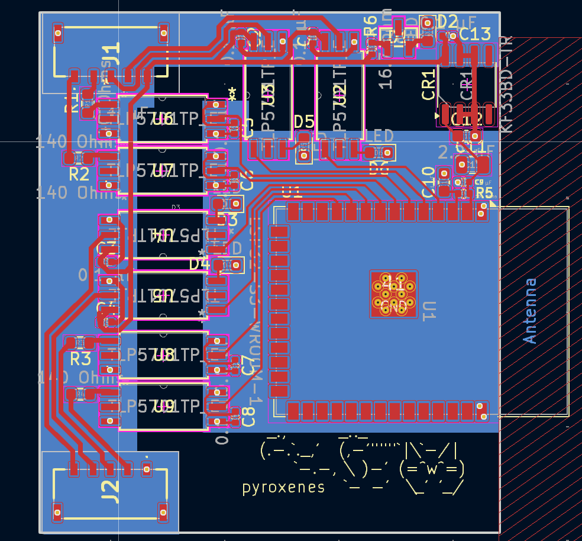</img>
  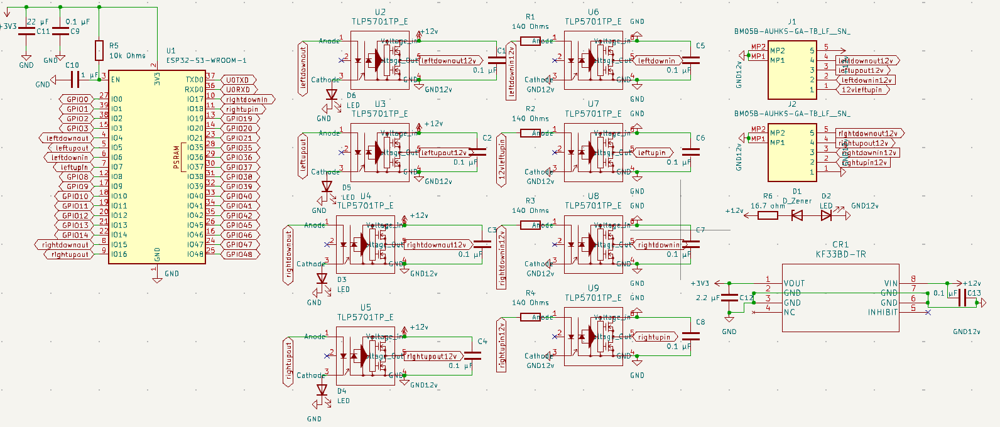</img>
  
Revision 1 PCB and schematic

  <b>⏦</b>
 

 

### Revision 2

We made a number of changes between Revision 1 and 2. On the first revision, our passive components were a mixture of 0402 (1005 metric) and 0603 (1608 metric) footprint sizes. We found the 0402 size to be too tedious for effecient hand assembling, so we switched entirely to 0603 size footprints from this revision onward.

  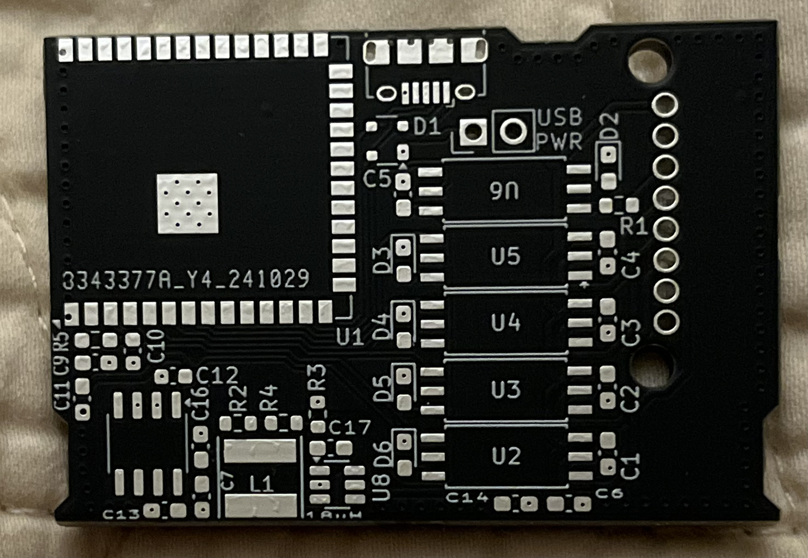</img>
  
unpopulated second revision board

  <b>⏦</b>
 

 

The biggest change implemented on this revision was the two stage power supply. We continued to use the KF33BD-TR LDO, but paired it with a TPP361061 buck converter. In this configuration we used the buck converter to generate a 5v supply from the 12-15v stage which was then fed into the LDO to provide the needed 3.3v for ESP32 operation. This completely solved the power supply overheating issues. We also were able to reduce the required number of optocouplers from 8 to 5. Instead of monitoring motor state, which proved to be unnecessary for the planned fuctions at the time, we chose to monitor the dashboard button to enable additional control features. This also reduced the number of required passive components and lowered the overall cost as the TLP5701 optocouplers were a large portion of total board cost.

  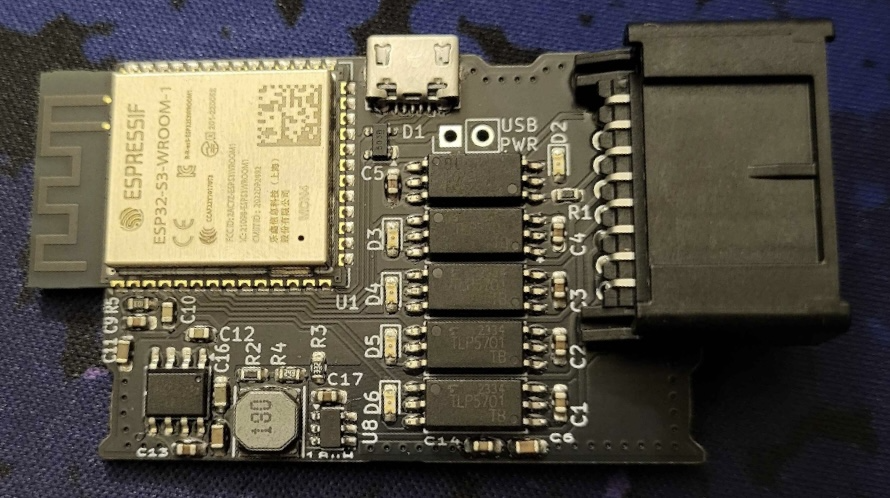</img>
  
Assembled second revision board

  <b>⏦</b>
 

 

For this revision we also changed the connector to a single Molex MINI50 8 position connector, which was a large improvement over the previous connector selection for this application. This enabled us to make a single cable wiring harness that could be more "plug and play" in the sense that it was able to directly plug into the existing Miata headlight connectors without modification to the car's wiring. The last change this version had was the addition of a diagnostic usb port with a connector to toggle power delivery over usb. This allowed us to reprogram the ESP32 after it was soldered and also enabled us to debug over serial during operation by viewing printouts. We also wanted to provide resistance to interference from the electrically noisy environment of the engine bay by stitching vias around the board edge, but went a bit overkill in this revision. We improved this to a reasonable level in the third revision. We also did not resolve the issue with the inputs yet.

  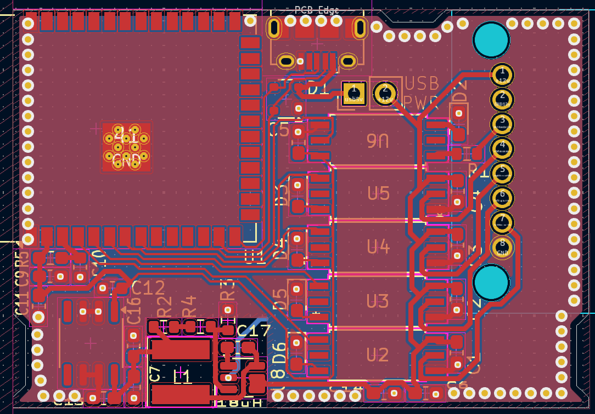</img>
  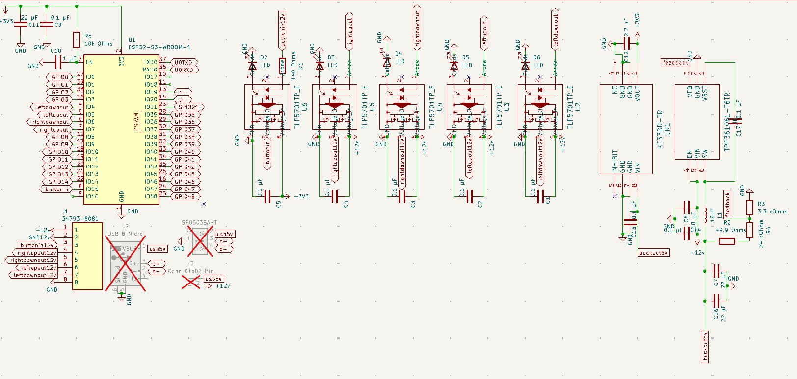</img>
   
Revision 2 PCB and schematic

  <b>⏦</b>
 

 

### Revision 3

  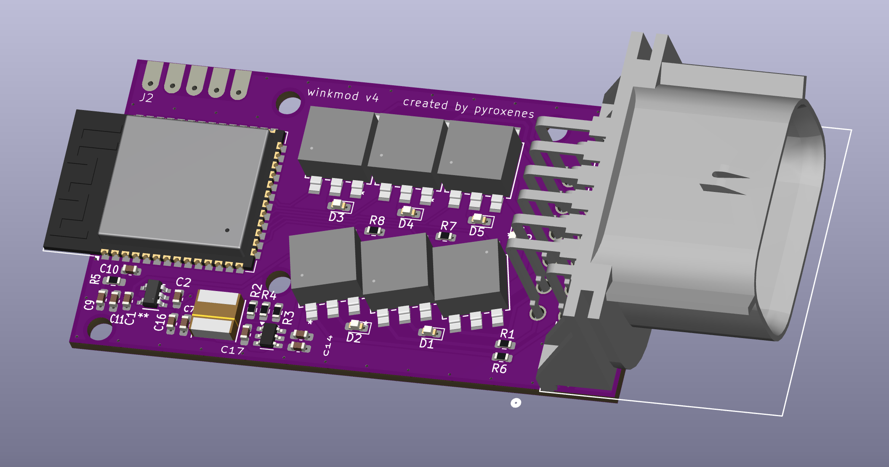</img>
  
rendering of assembled revision 3 board  (ignore the wrong rev numbering)

  <b>⏦</b>
 

 

For this revision we wanted to get the inputs working, so we selected a different optocoupler, the 4N25, to be used instead. We also changed the value of the input resistor to ~590Ω. To limit the cost of assembly, we decided to use this chip for both the inputs and outputs. This did end up getting the inputs working, but also created other issues because the 4N25 optocouplers were not able to drive the headlight motors, we think due to the optocouplers not being able to pass enough current.

  </img>
  
Assembled revision 3 board

  <b>⏦</b>
 

 

Another big change we made between rev 2 and 3 switching the wire harness connector. We decided to move away from the Molex MINI50 so we would have an easier time making a water tight/water resistant enclosure. We decided to go with the Molex MX120G because it was much easier to design a water tight case for.

  </img>
  </img>
   
Revision 3 PCB and schematic

  <b>⏦</b>
 

 

### Revision 4

  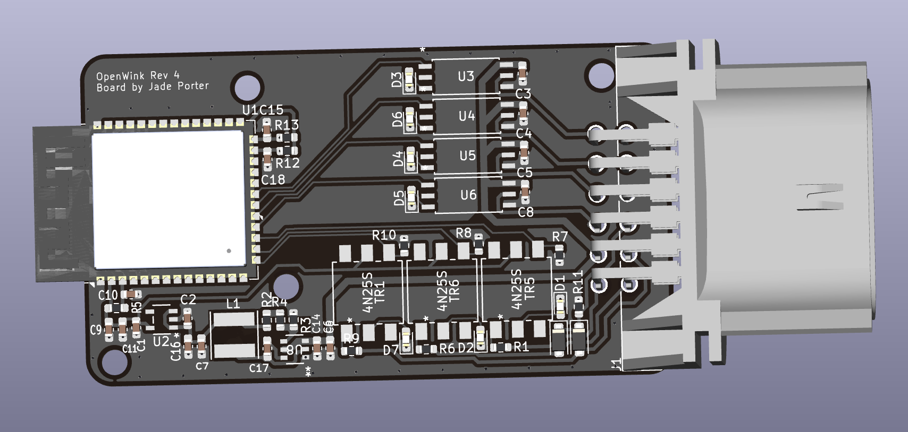</img>
  </img>
  
rendering of assembled revision 4 board, revision 4 board with solder paste

  <b>⏦</b>
 

 

Revision 4 was the first version that had both inputs and outputs working. We used TLP5701 optocouplers for the four output channels, and 4N25 optocouplers for the motion and button input channels. 

  </img>
  </img>
  
Revision 4 board with all SMD components placed prior to reflow, Assembled revision 4 board in case

  <b>⏦</b>
 

 

our initial batch of boards had an incorrect edge outline, so we had to sand down the excess material to provide enough clearance to slot the connector into our case. We printed the case out of clear PETG on a Bambu Lab X1C.

  </img>
  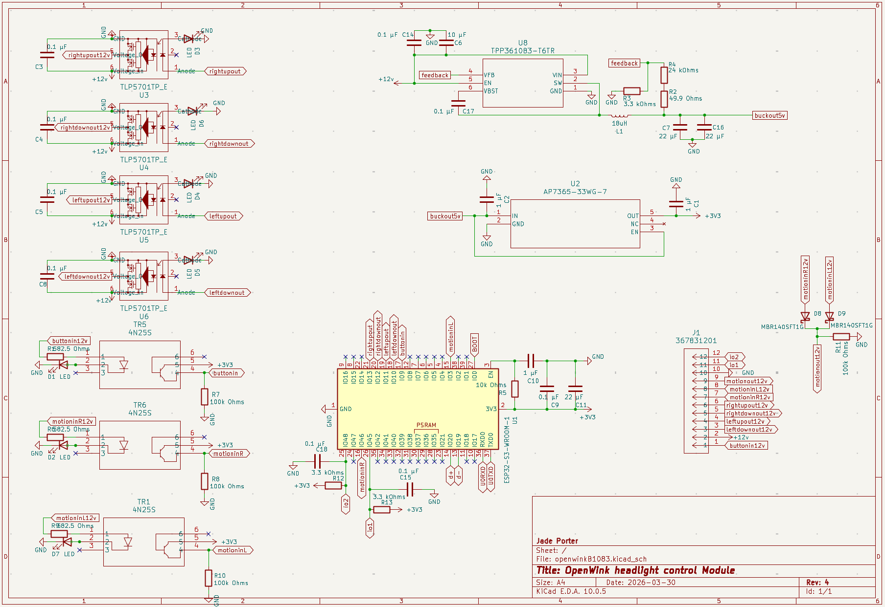</img>
   
Revision 4 PCB and schematic

  <b>⏦</b>
 

 

## Project Features

## Purchasing
Information about obtaining a pre assembled module will be coming soon

## Support the Project 

If you would rather support the open source initiative for the project, feel free to [donate](todo:☕) to keep the project alive.

## Acknowledgements
The Open Wink Hardware Module was created and is maintained by [pyroxenes](https://github.com/pyroxenes).

- Special thanks to [seasaltsaige](https://github.com/seasaltsaige) for creating and iterating on the mobile app and website. 
  - See related - [openwink](https://github.com/seasaltsaige/openwink/tree/master)

## Contact Me
You can reach me through my contact email at [todo:📧](todo:📧)
